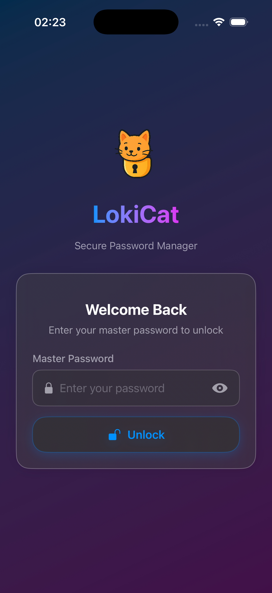
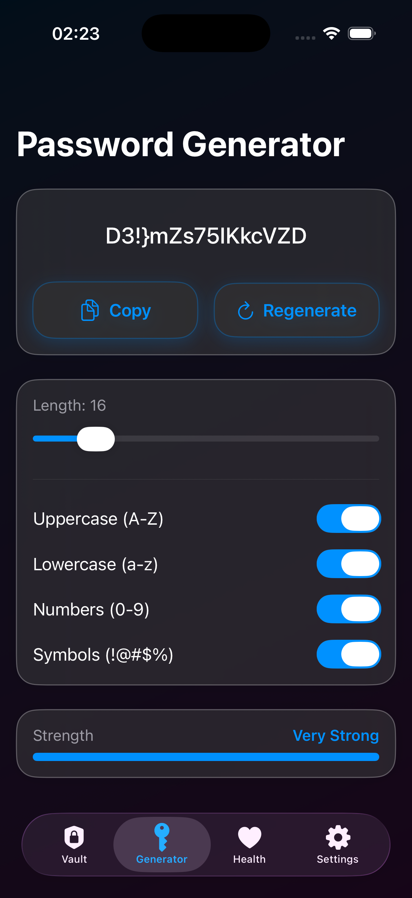
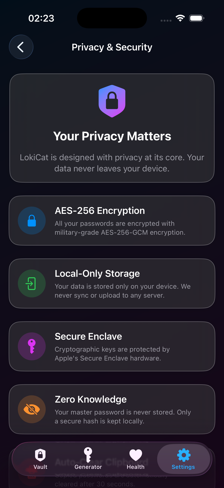
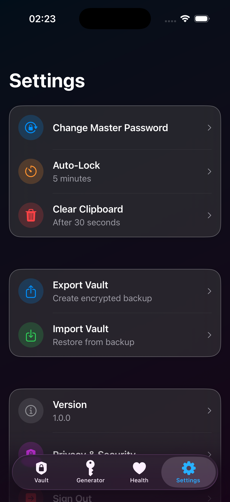
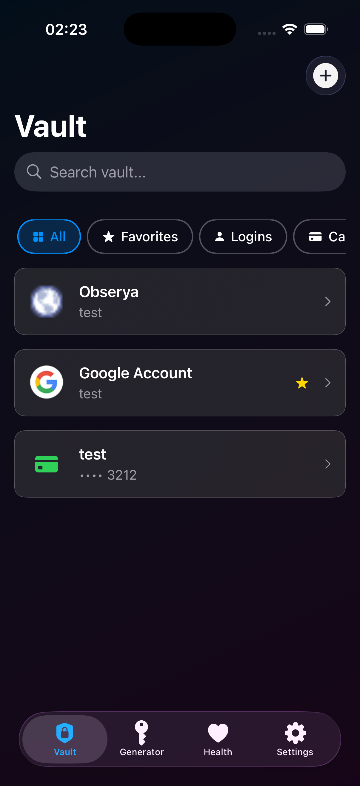
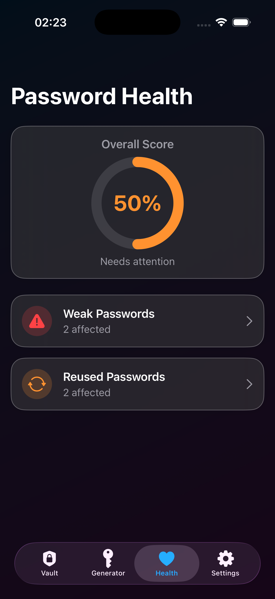

# LokiCat 🔐

A secure, modern password manager for iOS built with SwiftUI and featuring military-grade encryption.


## Features

### 🔒 Security First
- **AES-256-GCM Encryption** - Military-grade encryption for all your data
- **Local-Only Storage** - Your data never leaves your device
- **Secure Enclave** - Hardware-backed cryptographic key protection
- **Zero Knowledge** - Master password is never stored, only a secure hash
- **Biometric Authentication** - Face ID, Touch ID, and Optic ID support
- **Auto-Clear Clipboard** - Copied passwords automatically cleared after 30 seconds
- **Jailbreak Detection** - Security warnings on compromised devices

### 📦 Multiple Item Types
- **Login Items** - Store usernames, passwords, and URLs
- **Credit Cards** - Securely store card numbers, CVV, and expiry dates
- **Secure Notes** - Keep sensitive information in encrypted notes
- **Identity** - Store personal identification information
- **WiFi Passwords** - Remember network credentials
- **API Keys** - Manage your development keys

### 🛡️ Password Health
- **Weak Password Detection** - Identifies passwords that need strengthening
- **Reused Password Alerts** - Warns when passwords are used across multiple accounts
- **Old Password Tracking** - Reminds you to update passwords older than 6 months
- **Overall Security Score** - Visual dashboard of your password health

### 🎨 Modern UI/UX
- **Glassmorphism Design** - Beautiful liquid glass interface
- **Dark Mode** - Optimized for both light and dark themes
- **Smooth Animations** - Polished user experience
- **Intuitive Navigation** - Easy-to-use tab-based navigation

### ⚙️ Advanced Features
- **Password Generator** - Create strong, customizable passwords
- **Search & Filter** - Quickly find items by name, category, or tags
- **Favorites** - Mark important items for quick access
- **Categories & Tags** - Organize your vault efficiently
- **Export/Import** - Encrypted backup and restore functionality
- **Auto-Lock** - Configurable timeout settings

## Screenshots

<div align="center">

### Vault & Items
  

### Password Management
 

### Settings & Security
 

</div>

## Technical Details

### Architecture
- **MVVM Pattern** - Clean separation of concerns
- **Repository Pattern** - Centralized data management
- **Combine Framework** - Reactive programming with @Published properties
- **SwiftUI** - Modern declarative UI framework

### Encryption
- **Algorithm**: AES-256-GCM (Galois/Counter Mode)
- **Key Derivation**: PBKDF2 with 100,000 iterations
- **Salt Generation**: Cryptographically secure random salts
- **Keychain**: iOS Keychain for secure credential storage

### Security Features
- Master password hashing with SHA-256
- Automatic session locking
- Secure memory handling
- No logging of sensitive data
- Jailbreak detection

## Requirements

- iOS 17.0+
- Xcode 15.0+
- Swift 5.9+

## Installation

### For Development
1. Clone the repository
```bash
git clone https://github.com/burakozcn01/lokicat.git
cd lokicat
```

2. Open in Xcode
```bash
open lokicat.xcodeproj
```

3. Build and run on simulator or device

### For Testing
- Simulator build available in `lokicat_export/lokicat_simulator.zip`
- For real device testing, use Xcode's Archive and Export functionality

## Project Structure

```
lokicat/
├── Core/
│   ├── Security/         # Encryption, keychain, biometric managers
│   ├── Data/            # Models and repositories
│   └── Services/        # Business logic services
├── Features/
│   ├── Authentication/  # Login, setup, onboarding
│   ├── Vault/          # Item management and display
│   ├── PasswordGenerator/ # Password generation
│   └── Settings/       # App settings and preferences
└── UI/
    ├── Components/     # Reusable UI components
    └── Theme/         # Design system and styling
```

## Security Considerations

- **Never store sensitive data in UserDefaults or plain files**
- **All vault data is encrypted with AES-256-GCM**
- **Master password is hashed and never stored in plain text**
- **Cryptographic keys are protected by iOS Keychain**
- **Biometric credentials are hardware-backed**
- **Clipboard is automatically cleared after 30 seconds**
- **App data is encrypted at rest**

## Privacy

LokiCat respects your privacy:
- ✅ No analytics or tracking
- ✅ No cloud sync (data stays local)
- ✅ No internet connection required
- ✅ No third-party libraries with tracking
- ✅ Zero knowledge architecture
- ✅ Open source (coming soon)

## License

Copyright © 2025 Burak Özcan. All rights reserved.

## Author

**Burak Özcan**
- Bundle ID: tr.com.reloading.lokicat

## Acknowledgments

Built with:
- SwiftUI
- CryptoKit
- LocalAuthentication
- Combine

---

**⚠️ Security Notice**: This is a password manager that stores sensitive data. Always use a strong master password and enable biometric authentication. Never share your master password with anyone.

**🔐 Remember**: You are the only one who knows your master password. If you forget it, there is no way to recover your data. Keep it safe!
